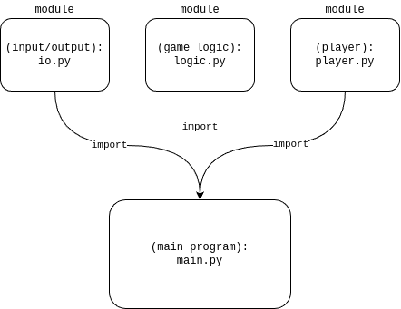
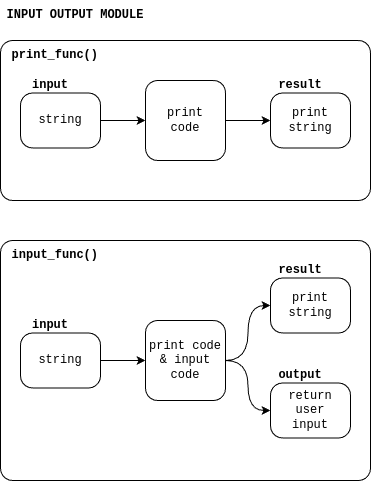
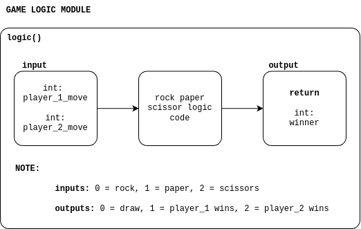

# Rock Paper Scissors

## Rationale
*(you can skip this part if you don't wanna hear me yap)*

When working alone on software projects, we tend to put little thought in how we implement our program. This usually isn't a big deal given the scale and simplicity of our previous projects. But in a more complex project where collaboration is requirement, it is essential for us to learn how to write code with collaboration and modularity in mind.

Therfore, in this project, we will focus on writing modular code that can easily be called and resused in different parts of the program and this program will be Rock Paper Scissors *(via the terminal/command prompt)*

## Goals
1. Learn basic software development collaboration via github
2. Implement software with modularity in mind
3. Better familiarity with Git and GitHub

## Program Architecture

The program will be split into three modules and the main program with each module being encapsulated within a file. Each module must implement its functionalities in a function that may or may not return a value. This allows for easy usage of the code in different parts of the progam. 

On the other hand, the main program is responsible for calling the functions that are implemented within the modules to form a program that allows users to play rock paper scissors in the terminal/command prompt 

### Module Layout

The three modules will have the following functionalities: **input/output**, **game logic**, **players**.

**Input/Output Module:** This module is responsible for implementing the functionalities for printing text on the terminal/command prompt and receiving user input via teh command prompt

**Game Logic Module:** This module is responsible for implementing the functionalities for deciding the outcome ofa round of rock paper scissors; *TLDR; who wins the round*

**Players Module:** This module is responsible for implementing the functionalities for keeping track off scores, the winner and losers of the game, and other behaviors and attributes.

**Module Implementation:**

### Module Architecture

### Input output

### Game Logic

### Player

## Instructions

